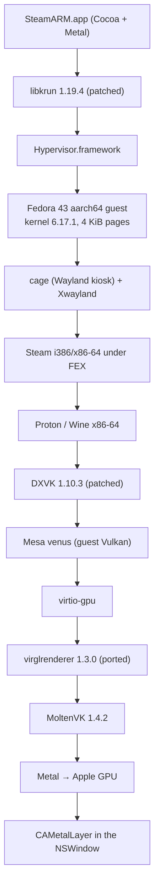

# ARCHITECTURE_CURRENT

**Status: CURRENT.** Everything here was read from the code or measured on the
running system. Nothing is planned or aspirational.

> Note (2026-09-27): this describes the retired VM architecture. Its code
> (src/, guest/, payload/, the VM-only scripts) has been deleted from the
> project (MIGRATION_PLAN.md, ZERO-VM exit criterion 9).

Measured on 2026-09-23, host: Apple M4, 10 cores (4P + 6E), 16 GB, macOS 27.

---

## 1. The load-bearing correction

The project brief assumes *"Steam utilizado por este proyecto es Linux ARM64"*
and therefore *"Steam NO debe ejecutarse mediante FEX"*.

That is false here. Evidence, `file(1)` on the actual installation:

```
ubuntu12_32/steam                ELF 32-bit LSB pie executable, Intel i386
ubuntu12_64/steamwebhelper       ELF 64-bit LSB pie executable, x86-64
aarch64 binaries in Steam:       0
x86-64 binaries in Steam:        3 (of the sample scanned)
```

Valve ships no ARM64 Steam **client**. What is ARM64 in this project:

```
Proton Experimental (ARM64)/files/bin-arm64/wine   ELF aarch64
FEX-Emu/usr/bin/FEX                                ELF aarch64
Proton - Experimental/files/bin/wine               ELF x86-64
Proton ARM64 .../dxvk/x86_64-windows/d3d11.dll     PE32+ x86-64
```

So Valve's Steam-on-ARM model is not "ARM64 Steam". It is:

- the Steam **client** stays i386/x86-64 and runs under FEX;
- an **ARM64 wine** runs natively and uses FEX only as its WOW64 CPU backend to
  execute the game's own x86-64 code;
- DXVK ships as x86-64 PE DLLs even inside the ARM64 Proton.

Consequence for the target architecture: a Linux→Darwin runtime **cannot avoid
x86-64/i386 Linux process support**. It is needed on day one, for Steam itself,
not only for games. See ARCHITECTURE_TARGET.md §2.

---

## 2. What the project is today

A native macOS app (`SteamARM.app`, 1376 lines of Objective-C) that boots a
Fedora 43 aarch64 guest with libkrun and presents the guest's display in an
`NSWindow`. Steam runs inside that guest.



---

## 3. Entry point and build

- `src/main.m` — `main()` → `NSApplication` → `SAAppDelegate`. Creates the
  window and `SADisplayView` (a `CAMetalLayer`-backed view), takes a `flock` on
  `instance.lock` to refuse a second instance, starts gvproxy, then runs the VM
  on a pthread.
- `Makefile` — `clang -fobjc-arc`, links `-lkrun`, `Cocoa`, `Metal`,
  `QuartzCore`. `make app` builds the bundle; `make install` copies it to
  `/Applications`.
- Payload in the bundle: `Image` (uncompressed arm64 kernel) and
  `initramfs.img`.

## 4. How the VM starts

`src/vm.m`, `sa_vm_run()`, in order:

```
krun_create_ctx
krun_set_vm_config(8 vcpus, 8192 MiB)
krun_set_console_output
krun_set_kernel(Image, KRUN_KERNEL_FORMAT_RAW, initramfs, cmdline)
krun_add_disk2(qcow2)
krun_add_virtiofs4("games", CrossOver library, 8 GiB DAX, read-only)
krun_add_net_unixgram(gvproxy socket)
krun_set_gpu_options2(VENUS | NO_VIRGL, 16 GiB shm)
krun_add_display(1920, 1080) + krun_set_display_backend
krun_add_input_device × 2 (keyboard, absolute pointer)
krun_start_enter        // blocks for the life of the VM
```

No firmware, no bootloader: the guest kernel is loaded directly from the app
bundle. `scripts/extract-kernel.sh` unwraps Fedora's EFI-zboot `vmlinuz`
(PE + zstd) into the bare arm64 `Image` that libkrun requires.

## 5. How Steam runs

`guest/steamarm.service` → `guest/steamarm-session` → `guest/steam-session`.

- `steamarm-session`: seatd session, `WLR_BACKENDS=drm,libinput`,
  `WLR_NO_HARDWARE_CURSORS=1`, `WLR_RENDERER=pixman`, blank cursor theme, then
  `exec cage -d -- /usr/local/bin/steam-session`.
- `steam-session`: runs `./ubuntu12_32/steam-runtime/run.sh ./ubuntu12_32/steam`
  directly, because `steam.sh` aborts on a 32-bit libc check that cannot pass
  on ARM.

Steam is x86-64/i386 and reaches the CPU through **FEX via binfmt_misc**
(`/usr/local/lib/binfmt.d/FEX-x86*.conf`, interpreter `/usr/local/bin/FEX`).

## 6. Where FEX is used

Everywhere x86 code runs, which in this project is *most* of the stack:

1. the Steam client and web helpers (binfmt, process level);
2. the x86-64 Proton/Wine and the game (binfmt, process level);
3. inside Proton ARM64, FEX would act as wine's WOW64 CPU backend — **this path
   does not work here**: `/usr/local/bin/FEX <x86 binary>` succeeds, but ARM64
   Proton fails because FEX's Windows path reads CPU features from the wine
   registry key `HKLM\Hardware\Description\System\CentralProcessor\0`, which
   this prefix never gets. Injecting the MRS-read ID registers into
   `system.reg` got past it; the run then died elsewhere. **BLOCKED**, see
   MIGRATION_PLAN.

FEX was rebuilt from `~/FEX` with `-DENABLE_JEMALLOC_GLIBC_ALLOC=False`: its
bundled jemalloc bakes in the page size and aborts with *"Unsupported system
page size"* on a 16 KiB-page guest.

## 7. Proton integration

No integration code. Steam installs and launches Proton itself. Two relevant
facts found by measurement:

- Steam picks `Proton - Experimental` (x86-64). Attempts to force
  `proton_11-arm64` / `proton-experimental-arm64` through `CompatToolMapping`
  in `config.vdf` were **rejected by Steam** — it then launched the game with
  no compatibility tool at all.
- Per-game `LaunchOptions` written into `localconfig.vdf` are **overwritten by
  Steam** when it rewrites its config. Environment therefore lives in
  `guest/steam-session`.

## 8. Graphics pipeline, and how a frame reaches Metal

```
game D3D11 → DXVK 1.10.3 → Vulkan → Mesa venus (guest)
  → virtio-gpu ring → libkrun → virglrenderer (host) → MoltenVK → Metal
```

That is the *game's* path. The **displayed frame** takes a second, separate
path — this is the important and expensive part:

1. `cage` composites in software (pixman) into a dumb buffer in guest RAM.
2. `TRANSFER_TO_HOST_2D` copies guest RAM → `host_backing` (patched
   host-native 2D resources in libkrun; virglrenderer cannot create 2D
   resources on macOS because there is no EGL/GL winsys).
3. `flush_resource` copies `host_backing` → a display frame buffer.
4. `present_frame` (`src/display.m`) uploads that into an `MTLTexture` with
   `replaceRegion:` and draws it to the `CAMetalLayer` drawable.

Three full-frame copies per presented frame. At 1080p that is ~24 MB/frame.

Measured presentation cost: **0.70–1.24 ms per frame**, ~88–160 fps when
vsync is disabled (`displaySyncEnabled = NO`, `maximumDrawableCount = 3`).
So presentation is *not* the current bottleneck — see PERFORMANCE_BASELINE.md.

## 9. Exact virtualization dependencies

| Dependency | Where | Removable without a rewrite? |
|---|---|---|
| `libkrun` (Hypervisor.framework) | `src/vm.m`, whole file | No — it *is* the VM |
| Guest Linux kernel + initramfs | app bundle Resources | No |
| `disk.qcow2` (14.4 GB) | Application Support | No |
| virtio-gpu / Venus / virglrenderer | display + game graphics | No |
| virtio-input | `src/input.m` | Interface reusable, transport not |
| virtio-fs | `krun_add_virtiofs4` | Concept reusable |
| gvproxy (userspace net) | `src/network.m` | Not needed without a guest |
| patched guest `virtio_gpu` module | `scripts/patch-virtgpu.py` | Dies with the VM |

## 10. Patches this project currently carries

| Component | Patch | Why |
|---|---|---|
| libkrun | host-native 2D resources | virglrenderer has no GL winsys on macOS |
| libkrun | keep select/subsel on failed config query | first ABS axis arrived `min == max`, libinput rejected the pointer |
| libkrun | log virgl flags; destroy stale ctx before create | diagnosis / id reuse |
| virglrenderer 1.3.0 | slp macOS/Venus stack ported forward | tap version reports vk_xml 1.3.252; Mesa 25.3.6 needs ≥ 1.4.307 |
| virglrenderer | synthesise `VK_KHR_external_memory_fd`, `VK_KHR_external_semaphore_fd` | MoltenVK has neither; without them Mesa exposes no device and no `VK_KHR_swapchain` |
| virglrenderer | emulate the two MESA semaphore-resource calls with empty queue submits | they only manipulate a semaphore payload |
| virglrenderer | pad host-visible allocations to a host page | blob 16384 vs allocation 1280 → `vkMapMemory` returned null → guest segfault |
| virglrenderer | strip `VkDeviceGroupDeviceCreateInfo` on Apple | untranslated guest handles → SIGSEGV in MoltenVK, killed the whole app |
| Linux `virtio_gpu` | align host-visible blobs to 16 KiB | `hv_vm_map` needs host-page granularity; FEX needs 4 KiB guest pages |
| DXVK 1.10.3 | 6 unconditional features made conditional | Metal has no geometryShader, logicOp, shaderCullDistance, variableMultisampleRate, transformFeedback, geometryStreams |
| FEX | built without bundled jemalloc | page-size assert |

Every one of these is a **VM-specific** patch except the DXVK one, which is the
only patch that carries over unchanged to a ZERO-VM design.

## 11. Tests and benchmarks

None in-repo. All verification this far has been ad-hoc:
`vulkaninfo`, `evtest`, `vkcube`, DXVK HUD, `screencapture` of the window,
frame counters in `src/display.m`, macOS `.ips` crash reports.

**This is the largest piece of technical debt.** ARCHITECTURE_TARGET.md and
MIGRATION_PLAN.md both assume a test harness gets built first.
