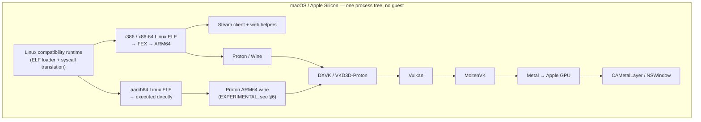

# ARCHITECTURE_TARGET

> **SUPERSEDED — VM-era.** Written as the plan to leave the VM. Its ZERO-VM
> core now exists (`docs/ARCHITECTURE.md`); the current target and its
> ordered plan are `docs/ARCHITECTURE.md` ("Target: ARM64-first") and
> `docs/ARM64_FIRST_MIGRATION.md`. Two claims below are out of date: it is
> no longer "planned", and Valve does ship a native arm64 Steam client
> (`benchmarks/stage21-native-arm64-client.txt`). Kept as history.

**Status: PLANNED.** Nothing here exists yet. Where a claim is uncertain it is
marked EXPERIMENTAL or BLOCKED rather than stated as fact.

---

## 1. Goal

Run Steam, Proton and Windows games on macOS Apple Silicon with **no VM, no
Linux kernel, no virtual CPU, no virtual GPU, no guest/host boundary** — by
translating Linux userspace semantics onto Darwin/XNU instead of virtualising
hardware.

## 2. The premise that has to change

The brief specifies "Steam ARM64 directo, sin FEX". Measured evidence
(ARCHITECTURE_CURRENT.md §1) shows Valve ships **no ARM64 Steam client**: the
client is i386, the web helper x86-64, and the installation contains zero
aarch64 binaries.

Therefore the target cannot be *"ARM64 fast path first, FEX later"*. It must be:



The ARM64 fast path is still worth building — it is what makes Proton ARM64
and any future native component cheap — but **x86-64 support is on the critical
path from milestone one**, because without it Steam does not start.

## 3. Layers, and what each must provide

### 3.1 ELF loader (`runtime/elf`, `runtime/loader`)
Map `PT_LOAD` segments, apply relocations, run `ld-linux-aarch64.so.1` /
`ld-linux-x86-64.so.2` or bypass it, build the Linux process start state:
`argc/argv/envp`, the **auxiliary vector** (`AT_PHDR`, `AT_PHENT`, `AT_PHNUM`,
`AT_ENTRY`, `AT_RANDOM`, `AT_HWCAP`, `AT_PAGESZ`, `AT_SYSINFO_EHDR`), and a
stack laid out as glibc expects.

Known hard problems, all real, none hand-waved:

- ~~**Page size.**~~ **MEASURED, not a problem.** Every aarch64 Linux binary
  surveyed — 3548 `PT_LOAD`s across a Fedora system, plus FEX and Proton's
  ARM64 wine — uses `p_align 0x10000`, a clean multiple of Darwin's 16 KiB
  page. 64 KiB is the aarch64 psABI max-page-size, so this is not a Fedora
  quirk. `runtime/elf.c` still verifies it per image rather than assuming.
- **`__PAGEZERO`. This is the real blocker, and it is hard.** Darwin reserves
  the low 4 GiB of every arm64 process and will not release it: every
  `-pagezero_size` below the 4 GiB default is SIGKILLed at exec, and both
  `mmap(MAP_FIXED)` and `mach_vm_allocate(VM_FLAGS_FIXED)` refuse that range at
  runtime. Linux ET_EXEC images link at 0x200000 with no relocations to move
  them, so **non-PIE Linux images cannot be loaded in-process at all**.
  Measured cost: 96.7% of `/usr/bin`, 100% of `/usr/lib64`, 100% of FEX and
  94.4% of Steam's binaries are PIE, so the exclusion is narrow but permanent.
- **TLS. Solved, but not the way Stage 2 first reported.** Darwin's thread
  pointer is in `TPIDRRO_EL0`, so the two do not collide — but `TPIDR_EL0` is
  *not* free either: Darwin preserves it across a syscall and clobbers it on
  any context switch. A guest that gets descheduled loses its thread pointer
  silently. The fix is the same mechanism as `svc`: every
  `mrs Xt, TPIDR_EL0` / `msr TPIDR_EL0, Xt` is rewritten to a trampoline that
  uses a Darwin TSD slot instead — three instructions, no scratch register,
  2.34 ns. 1440 such reads in glibc against 415 syscall sites. Proven both
  directions on a real glibc binary. See `benchmarks/stage3-tls.txt`;
  `stage2-tls.txt` is marked superseded.
- **Signals.** Linux `rt_sigaction`/`sigaltstack`/`ucontext_t` layouts differ
  from Darwin's; FEX additionally needs signals for SMC and JIT faults.
- **`vDSO`.** glibc expects `AT_SYSINFO_EHDR`; a synthetic vDSO must be
  provided or the aux entry omitted and the fallback path forced.

### 3.2 Syscall translation (`runtime/syscalls`) — MEASURED, and the design is now forced

Syscalls arrive as `svc #0`. Stage 1 measured what Darwin actually does with
that (PERFORMANCE_BASELINE §2.4, `benchmarks/README.md`), and the answer
eliminates two of the three candidates outright:

**Darwin ignores the SVC immediate.** `svc #0` with `x16 = 20` returns the
caller's pid — it is dispatched exactly like Darwin's own `svc #0x80`. A Linux
binary's `svc #0` therefore does **not** fault. It executes whatever Darwin
syscall number happens to sit in `x16`, with Linux arguments in `x0`–`x5`, and
returns as if nothing were wrong. There is no exception to catch.

So:

1. **Rewrite every `svc` site at load time** into a branch to the runtime
   dispatcher. Measured at **68 ns** including a real Darwin syscall
   underneath — cheaper than the `svc` it replaces — and **0.9 ns** when the
   runtime answers in userspace. **This is the only viable mechanism, and it is
   fast.** It is also now a *correctness* requirement: a missed site is silent
   misbehaviour, not a crash.
2. **Mach exception interception: rejected.** Measured at 6.32 µs, 55× a native
   syscall, and unreachable anyway since `svc` does not raise an exception.
   Retained only as a deliberate safety net: the loader can poison a site it
   cannot rewrite with an out-of-range `x16`, which *does* raise a catchable
   SIGTRAP (2.79 µs) — slow, but it fails loudly instead of silently.
3. **FEX must emit a call, not an `svc`.** Its JIT generates syscall sites at
   runtime that no load-time pass can see. Since Steam itself is x86
   (ARCHITECTURE_CURRENT §1), this is on the critical path, not an x86 extra.

The commonest call by a wide margin is `clock_gettime` at **70% of all guest
syscalls** (PERFORMANCE_BASELINE §2.3), inflated because FEX's x86 client
cannot use the guest vDSO. Answering it in the runtime turns the single most
frequent operation in the system into a 0.9 ns table lookup.

### 3.3 The subset to implement
Not "Linux". Only what tracing proves is used. Start from:
`futex`, `mmap`/`mprotect`/`munmap`, `clone`/`clone3`, `epoll`, `eventfd`,
`timerfd`, `openat`/`statx`, `memfd_create`, `pipe2`, `socket`, `rt_sig*`,
`sched_*`, `clock_gettime`, `prctl`, `set_robust_list`, `membarrier`.

Semantic traps that must not be papered over:
- `futex` vs. Darwin `__ulock_wait/wake` — different wake semantics, no
  `FUTEX_REQUEUE`, no robust lists. Requires a real implementation, not a map.
- `epoll` vs. `kqueue` — edge vs. level triggering, `EPOLLEXCLUSIVE`.
- `clone(CLONE_VM|CLONE_THREAD)` vs. Darwin threads — the runtime owns thread
  creation, not `pthread_create`.
- `/proc` — Steam and pressure-vessel read it. A synthetic `procfs` is needed.

### 3.4 Graphics (`graphics/`)
The one place where ZERO-VM is unambiguously simpler:

```
DXVK / VKD3D-Proton  →  Vulkan  →  MoltenVK  →  Metal
```

No Venus, no virtio-gpu, no virglrenderer, no guest compositor, **no
framebuffer copies**. Today's three full-frame copies per frame go to zero: the
game's swapchain images become Metal drawables directly.

The boundary problem: DXVK is an **ELF** (or PE, under wine) consumer of the
Vulkan ABI, while MoltenVK is a **Mach-O** dylib. Options, to be prototyped:

1. an ELF-shaped Vulkan ICD inside the runtime that thunks to the Mach-O
   MoltenVK — direct calls, no IPC; requires the runtime to load Mach-O
   dylibs into the same address space and bridge the ABI;
2. build MoltenVK as an ELF for the runtime (loses Metal framework linkage —
   probably not viable);
3. RPC to a Mach-O helper process — **explicitly the last resort**, it
   reintroduces exactly the serialisation ZERO-VM exists to remove.

(1) is the target. Note the AAPCS64 calling convention is the same on both
sides; the problem is loader and symbol resolution, not argument passing.

MoltenVK gaps are already known and carry over unchanged from today: no
`geometryShader`, `logicOp`, `shaderCullDistance`, `variableMultisampleRate`,
`transformFeedback`, `nullDescriptor`, `robustBufferAccess2`,
`VK_EXT_depth_clip_enable`. The DXVK patch that makes the first six optional
is the **only patch in this project that survives the rearchitecture**.

### 3.5 Presentation (`platform/macos`)
`VK_EXT_metal_surface` → `CAMetalLayer` → `NSWindow`. The existing
`src/display.m` letterbox/scale logic and `src/main.m` window handling are
reusable *as UI code*; the frame-transport half of `display.m` disappears.

### 3.6 Input
`src/input.m`'s event model (ring buffer, absolute pointer, relative capture
toggle) is reusable. Its transport (virtio-input) is replaced by delivering
events straight into wine/SDL.

> Note (2026-09-27): `src/` has been deleted from the project with the rest
> of the VM front-end (ZERO-VM exit criterion 9).

## 4. What is explicitly out of scope

Not a hardware emulator, not a userspace Linux kernel, not a container runtime.

~~Namespaces are implemented only if pressure-vessel proves to need them~~
**MEASURED, 2026-09-25: it needs them, and they cannot be implemented.**
`srt-bwrap` imports `unshare`, `setns`, `mount`, `umount2`, `capget`, `capset`,
`pivot_root`; macOS has none of it. And Steam's own UI already runs through
pressure-vessel, so this is not deferrable to game launch. The options are path
rewriting inside the runtime, bypassing pressure-vessel, or a fake `bwrap` —
see `benchmarks/stage6-steam-gap.txt`. A decision is required; it is not
mechanical work.

## 5. What gets reused from today

| Reused | Replaced |
|---|---|
| DXVK feature patch | libkrun and every patch to it |
| Window / Metal / letterbox code | display frame transport |
| Input event model and keymap | virtio-input transport |
| Guest provisioning knowledge | the guest itself |
| FEX build knowledge (no jemalloc) | binfmt registration |
| Benchmark and measurement method | — |

## 6. BLOCKED / unknown

- **Proton ARM64 under the runtime.** Today it fails because FEX's WOW64 path
  reads CPU features from a wine registry key the prefix never gets. Whether
  this is easier or harder without a VM is unknown.
- ~~**Cost of syscall interception.** Unmeasured. Decides the whole thesis.~~
  **RESOLVED** in Stage 1: trapping is impossible *and* slow; rewriting costs
  68 ns. See §3.2.
- **4 KiB vs 16 KiB pages for Linux ELFs on Darwin.** Likely the first wall.
- ~~**JIT memory.** FEX needs W^X-violating mappings; macOS requires
  `MAP_JIT` + `pthread_jit_write_protect_np`, and the hardened runtime
  entitlement. Interaction with FEX's code cache is unknown.~~ **RESOLVED**
  in Stage 5: the runtime turns a guest RWX request into `MAP_JIT`, and the
  guest asks for each write/execute flip through private syscall `0x4C580020`
  — a flip synthesised from a fault handler does not survive the return
  (measured). FEX carries a 34-line patch scoping its eight write sites;
  the disk code cache stays off (its `mremap` path is unimplemented here).
  See MIGRATION_PLAN Stage 5 item 4 and `benchmarks/stage5-jit.txt`.
  **Proven 2026-09-25:** a static x86-64 ELF runs to completion through
  FEX's JIT under the runtime (`benchmarks/stage5-fex.txt`).


## Addendum, 2026-09-25 — two host constraints every layer must honour

**x18 is not a register.** Darwin zeroes it on every exception return, preemption
included (MEASURED, `benchmarks/stage5-x18.txt`). Consequences for the target
architecture: FEX is built with `-ffixed-x18` and its JIT pool excludes r18
(`patches/fex-lxrt-x18.patch`); every other Linux image the runtime loads has
its x18 uses rewritten into per-thread-slot trampolines inside executable
sections only (`runtime/x18.c`, `runtime/elfsect.c`); any future guest image is
gated by `tests/x18_check.sh` (0 false positives/negatives on 1.27 M
instructions of the current corpus). ARM64EC Wine, which keeps the TEB in x18,
cannot run until that access is virtualised too.

**The low 4 GiB does not exist.** `__PAGEZERO` cannot be shrunk on arm64 macOS
(MEASURED). i386 guests and non-PIE x86-64 guests therefore need a guest
address base inside FEX (Milestone 4), not a runtime trick.

The upstream reuse plan that follows from the audit of the exact FEX commit in
use is `FEX_REUSE_ANALYSIS.md`; its table supersedes §4's "implement only if
needed" list for namespaces, thunks and the code cache.
